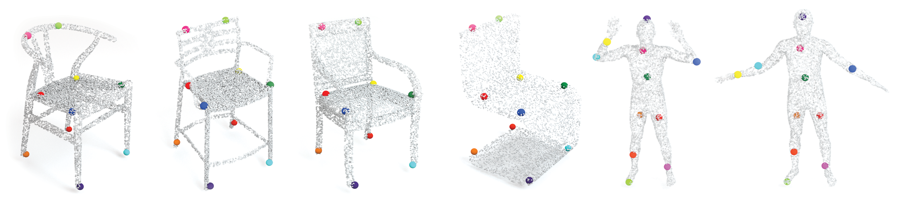

# Unsupervised Learning of Category-Specific Symmetric 3D Keypoints from Point Sets

This repository contains Pytorch original implementation of the [paper](https://arxiv.org/pdf/2003.07619.pdf): 'Unsupervised Learning of Category-Specific Symmetric 3D Keypoints from Point Sets' by Clara Fernandez-Labrador, Ajad Chhatkuli, Danda Pani Paudel, José J. Guerrero , Cédric Demonceaux and Luc Van Gool.

<p align="center">

</p>


## Introduction
Automatic discovery of category-specific 3D keypoints from a collection of objects of some category is a challenging problem. One reason is that not all objects in a category necessarily have the same semantic parts. The level of difficulty adds up further when objects are represented by 3D point clouds, with variations in shape and unknown coordinate frames. We define keypoints to be category-specific, if they meaningfully represent objects’ shape and their correspondences can be simply established order-wise across all objects. This paper aims at learning category-specific 3D keypoints, in an unsupervised manner, using a collection of misaligned 3D point clouds of objects from an unknown category. In order to do so, we model shapes defined by the keypoints, within a category, using the symmetric linear basis shapes without assuming the plane of symmetry to be known. The usage of symmetry prior leads us to learn stable keypoints suitable for higher misalignments. To the best of our knowledge, this is the first work on learning such keypoints directly from 3D point clouds. Using categories from four benchmark datasets, we demonstrate the quality of our learned keypoints by quantitative and qualitative evaluations. Our experiments also show that the keypoints discovered by our method are geometrically and semantically consistent.


## Citing

```bibtex
@article{fernandez2020unsupervised,
  title={Unsupervised Learning of Category-Specific Symmetric 3D Keypoints from Point Sets},
  author={Fernandez-Labrador, Clara and Chhatkuli, Ajad and Paudel, Danda Pani and Guerrero, Jose J and Demonceaux, C{\'e}dric and Van Gool, Luc},
  journal={European Conference on Computer Vision (ECCV)},
  year={2020}
}
```


## Datasets
We use the file ``data/create_datasets.py`` to prepare the input data.
You can access to our data [here](https://drive.google.com/drive/folders/1cydRB1IyY0AimAaZvLyYcRpY0zWk3WTq?usp=sharing). (More coming soon)
Check Data folder structure section.

We also refer to the official websites to download the original datasets:

- [ShapeNet](https://shapenet.cs.stanford.edu/iccv17/)
- [ModelNet10](https://modelnet.cs.princeton.edu/) *
- [Dynamic FAUST](http://dfaust.is.tue.mpg.de/)
- [Basel Face Model](https://faces.dmi.unibas.ch/bfm/index.php?nav=1-0&id=basel_face_model)
- [SUNRGB-D](http://rgbd.cs.princeton.edu/challenge.html)


## Requirements

``environment.yml`` contains a copy of the virtual environment with all the dependences and packages needed.
In order to reproduce it, simply run: 
```
conda env create -f environment.yml --name fernandez2020unsupervised
```

Start activating your environment:
```
conda activate fernandez2020unsupervised
```

Then, compile cuda module - index_max:
```
cd models/index_max_ext
python setup.py install
```

Now you are ready to go!

## Train

```bash
$ python train.py --dataset 'ShapeNet' --category 'airplane' --ckpt_model 'airplane_10b' --batch_size 32 --node_num 14 --node_knn_k_1 3 --basis_num 10 --input_pc_num 1600 --surface_normal_len 0
```

Check ``models/options_detector.py`` for more options.


## Evaluation

```bash
python test.py --dataset 'ShapeNet' --category 'airplane' --ckpt_model 'airplane_10b' --node_num 14 --node_knn_k_1 3 --basis_num 10 --input_pc_num 1600 --surface_normal_len 0
```

To visualize the results use ``viz.py``


## Evaluate pretrained models

You can try out directly some of our pretrained models.
The checkpoints can be found [here](https://drive.google.com/drive/folders/1cydRB1IyY0AimAaZvLyYcRpY0zWk3WTq?usp=sharing). Check Data folder structure section.

```bash
python test.py --dataset 'ModelNet10' --category 'chair' --ckpt_model 'chair_10b' --node_num 14 --node_knn_k_1 3 --basis_num 10
```

```bash
python test.py --dataset 'ShapeNet' --category 'airplane' --ckpt_model 'airplane_10b' --node_num 14 --node_knn_k_1 3 --basis_num 10 --input_pc_num 1600 --surface_normal_len 0
```


## Data folder structure
```
Data
│
└───dataset_1_name
│   └───checkpoints
│         └─model_1_name
│           |   checkpoint.tar
│           |   ...
│         └─model_2_name
│         └─...
│   └───results
│         └─model_1_name
│           |   name_file1.mat
│           |   ...
│         └─model_2_name
│         └─...
│   └───train_data_npy
│         └─category1
│           |   name_file1.npy
│           |   name_file2.npy
│           |   ...
│         └─category2
│         └─...
│   └───test_data_npy
│         └─category1
│         └─category2
│         └─...
│   
└───dataset_2_name
    │   ...
```


## License
This repository is released under GPL-3.0 License (see LICENSE file for details).

